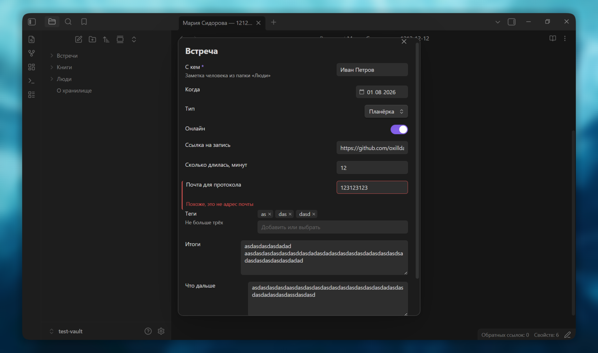
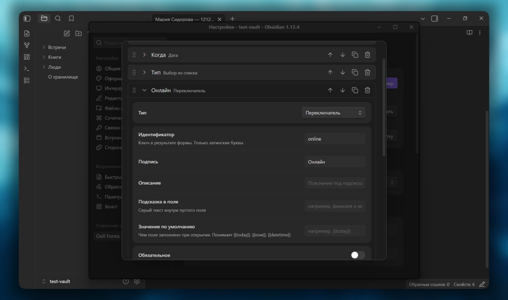
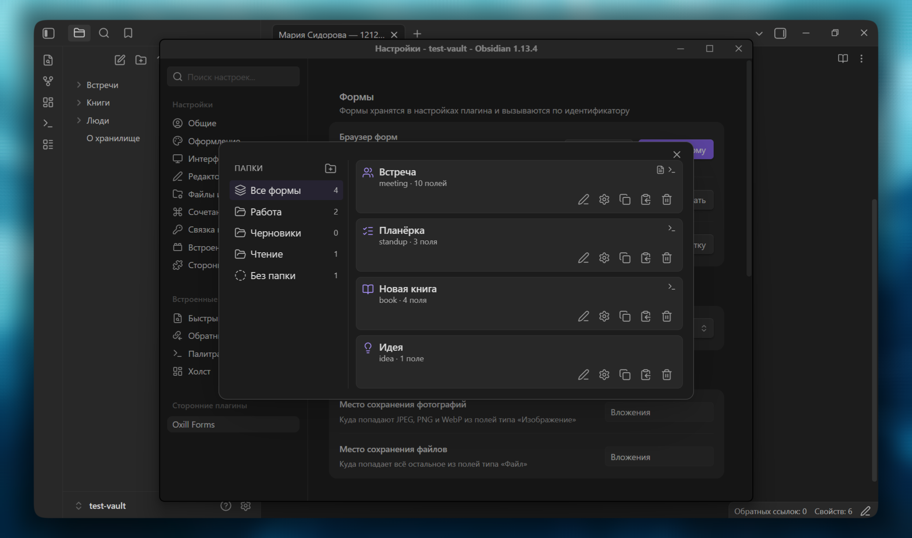

# Oxill Forms

Плагин для Obsidian: заполняете окошко с полями — получаете готовую заметку.

[English version](README.md)


## Содержание

- [Как это выглядит](#как-это-выглядит)
- [С чего начать](#с-чего-начать)
- [Что форма делает с ответами](#что-форма-делает-с-ответами)
- [Как назвать заметку и куда её положить](#как-назвать-заметку-и-куда-её-положить)
- [Что окажется внутри заметки](#что-окажется-внутри-заметки)
- [Чтобы форма не спрашивала лишнего](#чтобы-форма-не-спрашивала-лишнего)
- [Чтобы в заметку не попал мусор](#чтобы-в-заметку-не-попал-мусор)
- [Что можно спрашивать](#что-можно-спрашивать)
- [Когда форм становится много](#когда-форм-становится-много)
- [Если поле пришлось переименовать](#если-поле-пришлось-переименовать)
- [Перенос в другое хранилище](#перенос-в-другое-хранилище)
- [Соседние плагины](#соседние-плагины)
- [Из кода](#из-кода)
- [Справочники](#справочники)
- [Языки](#языки)
- [Ограничения](#ограничения)
- [Установка](#установка)
- [Разработка](#разработка)
- [Поддержка](#поддержка)
- [Лицензия](#лицензия)

## Как это выглядит

Допустим, после каждой встречи вы пишете заметку: кто был, когда, о чём
договорились. Каждый раз одно и то же — создать заметку, вписать дату,
перечислить участников. И каждый раз чуть по-разному: то «Участники», то
«участники», а вчера дату вообще забыли.

С этим плагином вы один раз описываете, о чём спрашивать: с кем встречались,
когда, что решили. Дальше вызываете команду — открывается окно с этими
полями. Заполнили, нажали «Отправить» — заметка готова: свойства
проставлены, заголовок на месте, курсор стоит там, где дописывать
подробности.

Плагин ничего не решает за вас: какие поля спрашивать, куда положить заметку
и как её назвать — всё это описываете вы, один раз на каждый вид заметок.

## С чего начать

1. **Заведите форму.** Настройки Obsidian → Forms → кнопка «Создать форму».
   Впишите идентификатор — короткое имя латиницей, например `meeting`, — и
   заголовок, который увидите в шапке окна: «Встреча». Там же ниже включите
   «Добавить команду» и выберите, что она делает: «Создать новую заметку».

2. **Опишите поля.** Настройки → «Список форм» → у карточки «Встреча»
   нажмите «Настройка полей» → «Добавить поле». Для начала хватит трёх:
   с кем встречались, когда, что решили.

3. **Заполните.** Ctrl+P → «Заполнить: Встреча».

Всё. Дальше — как сделать, чтобы заметка называлась по-человечески и ложилась
в нужную папку.

## Что форма делает с ответами

Рядом с включением команды стоит выбор «Что делает». Вариантов три.

**Создать новую заметку.** Самый частый случай: после встречи появляется
отдельная заметка. Ниже настраивается, как её назвать и в какую папку
положить.

**Вставить текстом по месту курсора.** Заметка уже открыта — скажем, заметка
проекта, — и вы дописываете в неё итог встречи. Текст встанет туда, где
стоял курсор.

**Изменить свойства текущей заметки.** В текст ничего не пишется, меняются
только свойства открытой заметки. Форма при этом открывается уже заполненной
тем, что в свойствах есть: вы правите пару строк, а не вбиваете всё заново.

Одна форма умеет что-то одно. Если для встречи нужно и заводить заметку, и
дописывать итог в проект — сделайте вторую форму: у карточки в списке есть
кнопка «Дублировать».

> **Форму можно позвать не только из палитры.** Команда формы — обычная
> команда Obsidian, поэтому её подхватит любой плагин, умеющий запускать
> команды: Buttons, Meta Bind, Commander. Так форма открывается кнопкой
> прямо в заметке или значком на панели — без палитры и горячих клавиш.
> А если вы пишете блоки DataviewJS, форму можно открыть прямо из скрипта:
> об этом в разделе «Из кода».

## Как назвать заметку и куда её положить

Если ничего не настраивать, заметка назовётся заголовком формы: «Встреча»,
потом «Встреча 1», «Встреча 2». Быстро надоедает.

В свойствах формы — там же, где вы включали команду, — есть два поля: «Имя
заметки» и «Папка для заметок». В них можно подставлять ответы: имя поля в
двойных фигурных скобках.

    Имя заметки:        {{person}} — {{date}}
    Папка для заметок:  Встречи

Заполнили форму, указав «Мария Сидорова» и «2026-08-01», — появилась заметка
«Мария Сидорова — 2026-08-01» в папке «Встречи».

`person` и `date` здесь — не выдумка: это те короткие латинские имена,
которые вы задавали каждому полю. Их видно в списке полей, в строке
«Идентификатор».

Папку тоже можно собирать из ответов. `Встречи/{{project}}` разложит заметки
по проектам, а если проект не заполнен — заметка ляжет прямо во «Встречи»,
без пустой папки внутри.

Незаполненное поле не оставляет за собой мусора: `{{person}} — {{date}}` без
участника даст просто дату, а не « — 2026-08-01».

А вот опечатку вы увидите: `{{persn}}` так и останется в названии заметки
текстом. Это нарочно — иначе ошибка превратилась бы в тихую пустоту, и вы
заметили бы её через сорок заметок.

## Что окажется внутри заметки

Название и папку настроили — осталось содержимое.

В свойствах формы есть большое поле «Шаблон заметки». Это обычный текст
будущей заметки, куда вы теми же скобками вставляете ответы:

    ---
    {{frontmatter}}
    ---

    # Встреча с {{person}}

    {{summary}}

    ## Что дальше

    {{next}}

    {{cursor}}

Получится заметка со свойствами наверху, заголовком, итогом и разделом «Что
дальше», а курсор встанет в самом низу — там, где дописывать подробности.

Две подстановки работают не как остальные:

- `{{frontmatter}}` — все ответы разом, готовыми свойствами заметки.
  Перечислять поля по одному не нужно; добавите завтра ещё одно — оно
  появится в свойствах само.
- `{{cursor}}` — место, где окажется курсор, когда заметка откроется.

Шаблон можно и не заполнять. Тогда плагин соберёт заметку сам — так, как
выбрано строкой выше, в «Формате результата»: свойствами в YAML, строками
«ключ:: значение» или маркированным списком.

### Как изменить ответ по дороге

Иногда ответ хочется вставить не буквально. После имени поля ставится
вертикальная черта и говорится, что с ним сделать:

    {{ person | link }}         [[Мария Сидорова]] — ссылка на заметку человека
    {{ participants | list }}   маркированный список, если значений несколько
    {{ project | slug }}        встреча-по-проекту — годится для имени файла

Остальные преобразования — в справочнике внизу.

## Чтобы форма не спрашивала лишнего

Форма из десяти полей, половина которых каждый раз остаётся пустой,
раздражает не меньше, чем заметка вручную. Убрать лишнее помогают три
настройки поля.

**Значение по умолчанию.** Дата встречи почти всегда сегодняшняя — пусть
подставляется сама. В настройках поля есть строка «Значение по умолчанию», и
она понимает три слова: `{{today}}` — сегодняшняя дата, `{{now}}` — текущее
время, `{{datetime}}` — и то и другое. Поле откроется уже заполненным, а
поправите его в тот редкий раз, когда встреча была вчера.

**Обязательное.** Поставьте галочку — и форму нельзя будет отправить, пока
поле пустое. Для встречи это участник: заметка без него бессмысленна.

**Условие показа.** Заведите переключатель «Онлайн», а полю «Ссылка на
запись» поставьте условие: показывать, когда «Онлайн» включено. Пока
переключатель выключен, поля просто нет — оно появится, когда понадобится.

Условие читается целой фразой: «показывать поле, когда `online` включено».
Сравнить можно с заполненностью, равенством, вхождением текста, началом и
концом строки, а для чисел — больше и меньше.

**Разделы.** Поле типа «Раздел» — не вопрос, а заголовок внутри формы. Он
делит длинную форму на части; а если поставить условие на сам раздел, с ним
спрячутся все поля до следующего заголовка. Это когда форма ветвится не
одним полем, а целым куском.

## Чтобы в заметку не попал мусор

«Обязательное» следит, что ответ вообще есть. Проверки следят, что ответ
похож на правду.

**Само собой.** Поля «Электронная почта» и «Телефон» проверяются без единой
настройки: если в почте нет собаки, форма не отправится.

**Числа.** У поля «Сколько длилась, минут» поставьте «Не меньше 5» и «Не
больше 600» — опечатка в три нуля не пройдёт.

**Длина текста.** От «Итогов» можно потребовать хотя бы двадцать символов:
запись «ок» через месяц вам ничего не скажет.

**Количество.** У тегов и множественного выбора считаются не символы, а
значения: «Значений не больше 3» не даст обвешать встречу десятью тегами.

**Своё правило.** Если нужно строго, есть «Соответствует выражению»:
`^\d{4}-\d{2}$` пропустит только номер вида `2026-08`. Рядом стоит
«Сообщение об ошибке» — его стоит заполнить, потому что само выражение
читателю ничего не объяснит.

Проверки срабатывают при отправке: ошибка появляется под своим полем, а внизу
окна написано, сколько полей ждут внимания. Пустое поле проверками не
трогается — за пустоту отвечает «Обязательное».



В настройках поля видны только те правила, которые для него осмысленны: у
числа нет длины, у переключателя нет ничего.

## Что можно спрашивать

Кроме текста, числа и даты в форму кладётся ещё десяток видов вопросов.
Полный список — в справочнике внизу; здесь те, ради которых туда стоит
заглянуть.

**Заметка из папки.** Для встреч — самое полезное. Поставьте полю тип
«Заметка из папки» и укажите папку «Люди»: вместо того чтобы писать имя
руками, вы выбираете существующую заметку из списка. А `{{ person | link }}`
в шаблоне превратит ответ в `[[Мария Сидорова]]` — и встреча сама появится в
списке ссылок на странице человека.

**Выбор из списка.** Готовые варианты: «планёрка», «созвон», «интервью».
Одно значение или несколько — это два разных типа: «Выбор из списка» и
«Выбор нескольких». Варианты можно брать не из заданного списка, а из папки
с заметками — тогда список растёт вместе с хранилищем сам.

**Теги.** Поле подсказывает теги, которые в хранилище уже есть, и разрешает
вписать новый. Если служебных тегов много, ненужные ветки можно не
предлагать — для этого в настройках поля есть строка «Не предлагать теги».

**Ползунок.** Оценка от единицы до пяти, мимо диапазона не промахнёшься.

**Изображение и файл.** Форма положит файл в хранилище и вставит в заметку
ссылку на него. Класть можно в общую папку из настроек плагина или в свою у
этого поля, а имя собрать из ответов: `{{person}}-запись`.

**Папка.** Когда спросить нужно не заметку, а место в хранилище. Выбор можно
ограничить одной веткой, чтобы в списке не мелькали все двести папок.

**Список из запроса Dataview.** Для тех, у кого стоит Dataview: варианты
считаются запросом и умеют зависеть от других полей формы. Подробнее — в
разделе «Соседние плагины».



## Когда форм становится много

Список форм открывается кнопкой «Список форм» в настройках или командой
«Браузер форм». Слева папки, справа карточки.

Папка здесь — просто ярлык для раскладки, к папкам хранилища она отношения не
имеет. Создаётся кнопкой со значком папки над списком: вписали название,
нажали Enter. Формы раскладываются перетаскиванием — взяли карточку,
бросили на папку слева.

Пустую папку убирает крестик, который появляется при наведении. Если папка не
пуста, плагин переспросит и предупредит: сами формы никуда не денутся, они
просто станут «без папки».

На карточке формы пять кнопок: свойства, настройка полей, дублирование,
экспорт в буфер обмена и удаление.



## Если поле пришлось переименовать

Вы завели сорок заметок о встречах, а потом решили, что `person` правильнее
назвать `participant`. Обычно после такого в старых заметках остаётся
свойство со старым именем, и половина запросов перестаёт их находить.

Плагин это чинит: он помнит, как поле называлось раньше, и переименовывает
свойство в заметках, которые сам же и создал.

Как именно — вы выбираете в настройках, в разделе «Заметки». Включённая
галочка «Автоматически обновлять заметки при изменении формы» чинит сразу
после сохранения формы. Выключенная — оставляет кнопку «Сканировать
хранилище»: плагин найдёт такие заметки, покажет, сколько их, и станет ждать
подтверждения. Правка чужих заметок необратима, поэтому по умолчанию плагин
спрашивает.

## Перенос в другое хранилище

Формы живут в настройках плагина, а не в хранилище: заметки они создают, но
сами в них не лежат. Поэтому просто скопировать папку не получится — есть
экспорт.

«Экспорт всех форм» в настройках кладёт все формы одним куском JSON в буфер
обмена или в новую заметку. «Импорт форм» читает этот кусок обратно — можно
и одну форму, и десяток сразу.

Если конверт сделан более новой версией плагина, импорт предупредит: часть
настроек он не поймёт и отбросит. А если внутри есть поля с запросами
Dataview, покажет их код и переспросит — это исполняемый код, пришедший из
чужих рук, и читать его стоит до, а не после.

## Соседние плагины

**Dataview.** Поле «Список из запроса Dataview» берёт варианты из результата
запроса. Запросу доступны не только заметки, но и уже заполненные поля формы
— поэтому список во втором поле может зависеть от ответа в первом: выбрали
проект, и участники подставились только из этого проекта.

Такие поля исполняют написанный вами JavaScript, поэтому тип по умолчанию
выключен. Включается в настройках, в разделе «Дополнительно».

**Templater.** Если вы им пользуетесь, включите «Обрабатывать шаблоны через
Templater» там же. Тогда команды `<% … %>` в шаблоне формы исполнит он, а
наши подстановки `{{ поле }}` отработают до него — Templater получит уже
готовый текст.

## Из кода

Если вы пишете скрипты — в Templater, QuickAdd, DataviewJS или прямо в
консоли, — форму можно открыть оттуда и получить ответы:

```js
const result = await OxillForms.openForm("meeting");
if (!result.ok) return;                         // форму закрыли

result.get("person")                            // одно значение
result.getData()                                // все ответы объектом
result.link("person")                           // [[Мария Сидорова]]
result.asFrontmatter({ omit: ["draft"] })       // свойства без служебных полей
result.asString("{{ person }} — {{ date }}")    // своя строка из ответов
```

Отмена — не ошибка: промис исполнится результатом со статусом «отменено»,
поэтому проверяйте `result.ok`.

Форму можно собрать прямо в скрипте, тогда её не нужно заводить в настройках
— шаблон получается самодостаточным:

```js
const form = OxillForms.builder("meeting", "Встреча")
    .note({ name: "person", label: "С кем", folder: "Люди", required: true })
    .date({ name: "date", label: "Когда", default: "{{today}}" })
    .textarea({ name: "summary", label: "Итоги" })
    .build();

const result = await OxillForms.openForm(form);
```

Предзаполнить поля можно двумя способами: `openForm("meeting", { values })`
подставит переданное, а `openForm("meeting", { fromNote: true })` — то, что
уже лежит в свойствах открытой заметки.

Имя `Forms` занято другим плагином? Его можно поменять в настройках, в
разделе «Дополнительно».

## Справочники

<details>
<summary><b>Все типы полей</b></summary>

| Тип | Что это |
| --- | --- |
| Текст | однострочный ввод |
| Многострочный текст | абзац и больше |
| Электронная почта, Телефон | то же, но с проверкой формата |
| Число | целое или дробное, с границами |
| Ползунок | число мышью, с минимумом, максимумом и шагом |
| Переключатель | да или нет |
| Дата, Время, Дата и время | выбор в системном виджете |
| Выбор из списка | одно значение: заданный список или заметки из папки |
| Выбор нескольких | то же, но значений много; ещё умеет запрос Dataview |
| Теги | теги хранилища, свои тоже можно вписать |
| Список из запроса Dataview | одно значение из результата запроса |
| Заметка из папки | существующая заметка, выбор из списка |
| Папка | папка хранилища, выбор можно ограничить веткой |
| Изображение | JPEG, PNG, WebP — файл ляжет в хранилище |
| Файл | любой файл, можно ограничить расширения |
| Раздел | не вопрос, а заголовок внутри формы |

</details>

<details>
<summary><b>Настройки поля</b></summary>

Общие для всех: подпись, описание под ней, подсказка внутри пустого поля,
значение по умолчанию, обязательность, условие показа и проверки ответа.

Скрытое поле в форме не рисуется вовсе — оно нужно, когда значение приходит
из кода через `openForm(..., { values })` и должно попасть в результат.

Своё есть у некоторых типов:

- **Выбор нескольких** — несколько папок-источников сразу.
- **Теги** — выражение для тегов, которые не нужно предлагать.
- **Папка** — ветка, внутри которой идёт выбор.
- **Изображение и Файл** — своя папка сохранения и шаблон имени файла; у
  файла ещё список допустимых расширений.

</details>

<details>
<summary><b>Подстановки и преобразования</b></summary>

Подстановки работают в шаблоне заметки, в имени заметки и в папке для
заметок: `{{ поле }}`.

Особые: `{{frontmatter}}` — все ответы свойствами разом, `{{cursor}}` — куда
встанет курсор.

В значении по умолчанию понимаются `{{today}}`, `{{now}}` и `{{datetime}}`.

Преобразования пишутся после вертикальной черты — `{{ поле | upper }}`:

| | |
| --- | --- |
| `upper`, `lower` | ВЕРХНИЙ и нижний регистр |
| `capitalize` | Первая буква заглавная |
| `trim` | убрать пробелы по краям |
| `slug` | имя-для-файла |
| `snake` | имя_для_ключа |
| `link` | `[[ссылка]]` |
| `list` | маркированный список из нескольких значений |

</details>

<details>
<summary><b>Настройки плагина</b></summary>

- **Формы** — браузер, создание, импорт и экспорт.
- **Язык** — язык окон, настроек и команд.
- **Вложения** — общие папки для изображений и файлов.
- **Дополнительно** — скрывать «Все формы», когда всё разложено по папкам;
  не спрашивать при закрытии без сохранения; разрешить поля Dataview;
  обрабатывать шаблоны через Templater; имя переменной с API.
- **Заметки** — чинить заметки после переименования поля автоматически или
  по кнопке.

</details>

## Языки

Плагин говорит по-английски, по-русски, по-немецки, по-французски,
по-испански и по-китайски. При установке он смотрит, на каком языке говорит
Obsidian, и берёт его, если такой есть; иначе английский. Дальше язык
меняется в настройках и на язык Obsidian больше не оглядывается.

## Ограничения

- Нужен **Obsidian 1.13.0** или новее.
- На телефоне и планшете **не работает перетаскивание** форм по папкам и
  полей в редакторе: касания браузер здесь не понимает. Порядок меняется
  кнопками со стрелками, а формы раскладываются через свойства формы.
- Поля «Список из запроса Dataview» **исполняют написанный вами код**.
  Поэтому тип выключен по умолчанию.

## Установка

**Нужен Obsidian 1.13 или новее.** На версии старше каталог отвечает «no
appropriate version found» — обновите Obsidian, и плагин поставится.

**Из каталога сообщества**: Настройки → Сторонние плагины → Обзор → найдите
«Oxill Forms» → Установить → Включить.

**Вручную**: скачайте `main.js`, `manifest.json` и `styles.css` из
[последнего релиза](../../releases/latest) и положите в папку
`<хранилище>/.obsidian/plugins/oxill-forms/`.

## Разработка

```bash
npm install
npm run dev     # сборка в watch-режиме
npm run build   # production-сборка в корень репозитория
npm test        # тесты логики, не зависящей от Obsidian
npm run check   # tsc --noEmit
```

`npm run dev` заодно кладёт сборку в хранилище для проверки: задайте
`OXILL_FORMS_VAULT` путём к папке плагина внутри него или держите `test-vault`
рядом с репозиторием.

Тесты лежат рядом с кодом, в `src/core/*.test.ts`. Покрыта логика, которой не
нужен Obsidian, — там и живут неочевидные вещи вроде склейки имени заметки из
незаполненных полей.

Новый язык добавляется одним файлом в `src/i18n/`: словарь объявлен так, что
пропущенный перевод не даст проекту собраться.

## Поддержка

Если хотите поддержать меня и мою работу — подпишитесь на мои соцсети или
задонатьте на Бусти:

* [https://t.me/oxilldat](https://t.me/oxilldat)
* [https://boosty.to/oxilldat](https://boosty.to/oxilldat)

## Лицензия

[MIT](LICENSE)

> Написан с нуля, вдохновлён
> [obsidian-modal-form](https://github.com/danielo515/obsidian-modal-form) —
> спасибо его автору за идею.
